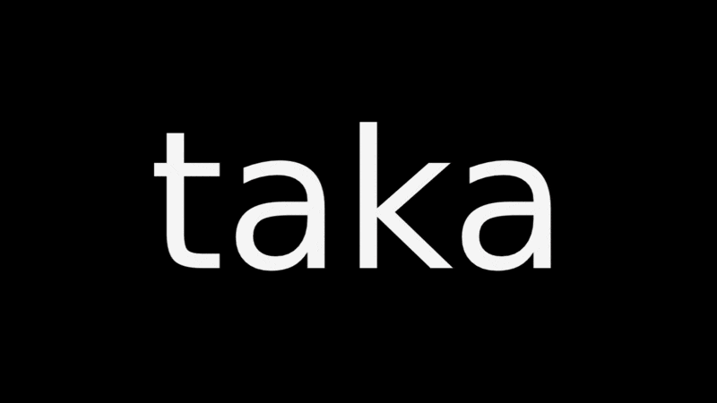
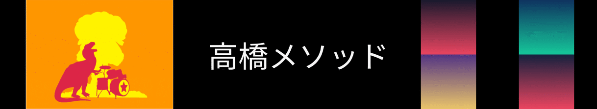

<div align="center">

# taka

### Big text. Few words. Fast slides.

A presentation tool in the spirit of the [takahashi method]: one idea per
slide, scaled to fill the screen. The speaker is the show — the slides just
keep time.



<sub>The deck above is [`examples/demo/demo.taka`](examples/demo/demo.taka) — taka, presenting taka.</sub>

</div>

---

## The idea

Cram a paragraph onto a slide and the room reads instead of listening. The
takahashi method does the opposite: **many slides, a few huge words each**.
Every slide lands in a second, so attention stays on you.

- The presentation's focus is the **speaker**; slides are auxiliary.
- Slides keep the audience oriented — where are we, start to end?
- A slide should be understood in **seconds**, then get out of the way.

## Write a slide, get a deck

A `.taka` file is plain UTF-8 text. **Blank lines separate slides.** That is
the entire structure.

```taka
Simple

Made

Easy
```

Three words → three slides, each scaled to fill the frame.

## Everything you can put on a slide

**Inline styles** — `*bold*`, `/italic/`, `` `mono` ``, `_underline_`,
`-strike-`, `|reverse|`. A backslash escapes a marker (`\*` → `*`). Stray
`/` and `-` in URLs or hyphenated words stay literal.

**Media** — scaled to fill, laid out behind the text:

```taka
@image(diagram.png)                 one image, scaled to fill
@image(a.png) @image(b.png)         many images → an equal grid
@audio(applause.mp3)                sound on entry
```

**Live command output** with `@run` — taka builds the pipeline itself, so
there's **no shell** and it behaves the same everywhere. `%` expands to the
deck's path:

```taka
this deck is
@run(/usr/bin/wc -l % | /usr/bin/tr -cd 0-9)
lines
```

**Speaker notes** — `@note(...)` records prose for the presenter view:
invisible to the audience, synced to the slide it sits on. A line starting
with `#` is just a private authoring comment, dropped entirely.

Real fonts, rasterized with stb_truetype — so **CJK just works**:

```taka
高橋メソッド
```

The full, normative definition lives in [`SPEC.md`](SPEC.md).

<div align="center">



<sub>Slides from the bundled decks — [`examples/wat`](examples/wat/wat.taka)
(Gary Bernhardt's *Wat*), the Japanese type from
[`examples/demo`](examples/demo/demo.taka), and an `@image` grid.</sub>

</div>

## Four ways to show it

One deck, four renderers:

```sh
zig build run -- examples/demo/demo.taka                      # full-screen window
zig build run -- examples/demo/demo.taka --to terminal        # in your terminal
zig build run -- examples/demo/demo.taka --to html -o deck.html
zig build run -- examples/demo/demo.taka --to pdf  -o deck.pdf
```

Add **`--watch`** to any form to re-render live as you edit the deck — the
interactive forms reload in place and keep your position; the file forms
regenerate their output. Pass **`-`** as the file to read the deck from stdin.

The window and terminal forms are interactive: **→ / Space** advance, **←**
back, **Home / End** jump, **q / Esc** quit. Speaker notes stay off the
audience's screen:

- **Window** — launch it from a terminal and the current slide's notes appear
  there, synced as you navigate. The window goes on the projector; the notes
  stay on your screen.
- **Terminal** — the terminal *is* the slides, so run a second instance
  alongside it: `taka <deck>.taka --speaker` follows the running presentation
  and shows the notes in its own terminal.
- **Browser** — press **p** for a synced presenter window with the notes.

## Quick start

taka is built with [Zig 0.16](https://ziglang.org). The window form links a
few ubiquitous system libraries for the window and audio (OpenGL/X11 on Linux,
the platform frameworks on macOS/Windows); text, images, and the rest are
vendored. **No Zig package dependencies — the build fetches nothing.**

```sh
zig build            # build the app
zig build run -- <deck>.taka   # present it
zig build test       # unit + integration tests (offline, headless)
zig build check      # formatting gate
```

## Under the hood

- **Window** — [sokol](https://github.com/floooh/sokol) (vendored) for the
  window and immediate-mode rendering; stb_truetype for text, stb_image
  for pictures, miniaudio for sound (all vendored).
- **Terminal / HTML / PDF** — pure Zig; the HTML is self-contained (images
  embedded), the PDF is written by hand.
- Why vendored + system libraries instead of packages?
  [`docs/window-backend.md`](docs/window-backend.md).

## More

- [`SPEC.md`](SPEC.md) — the format, the CLI, the output forms
- [`examples/`](examples/) — real decks (incl. the Japanese original and the demo)
- [`docs/TESTING.md`](docs/TESTING.md) — how taka is tested
- [`CLAUDE.md`](CLAUDE.md) — coding rules

<div align="center"><sub><b>文字は 大きく — 人に やさしく.</b> Big letters; be kind to people.</sub></div>

[takahashi method]: http://www.rubycolor.org/takahashi/
